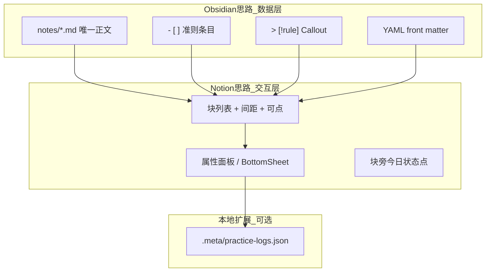
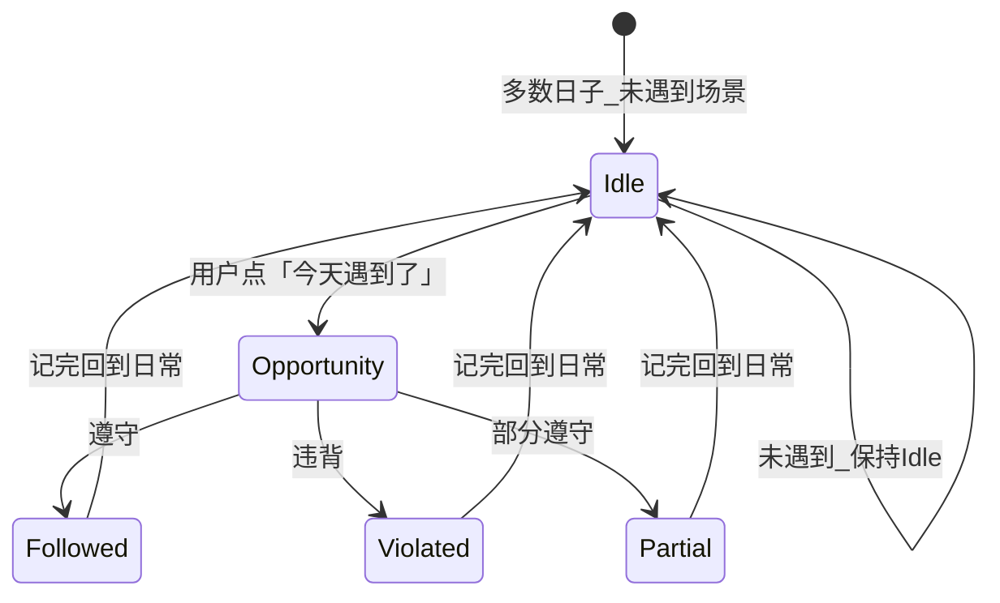
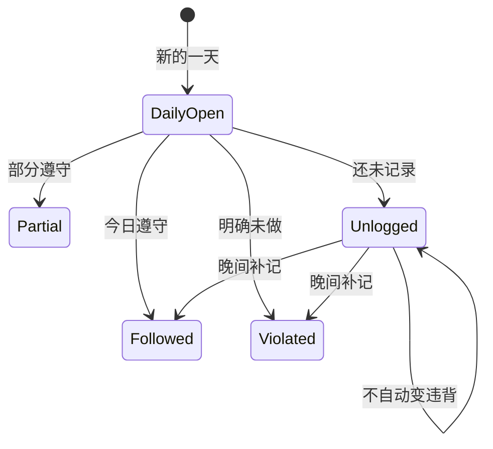
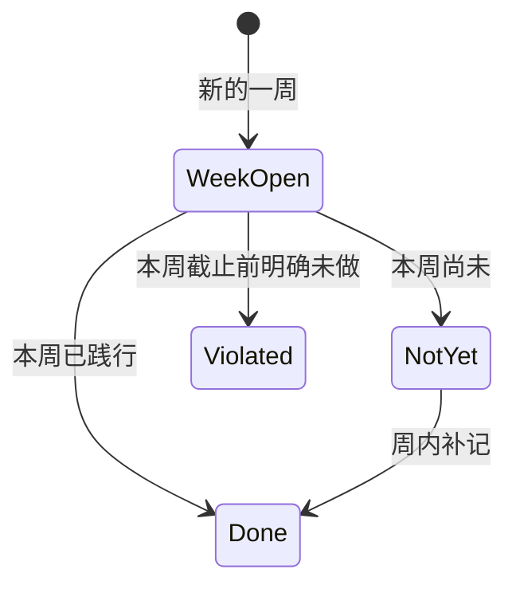
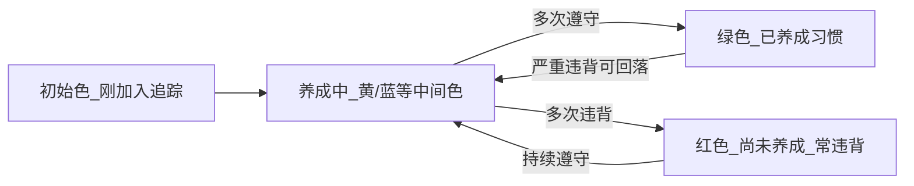
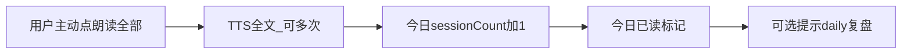
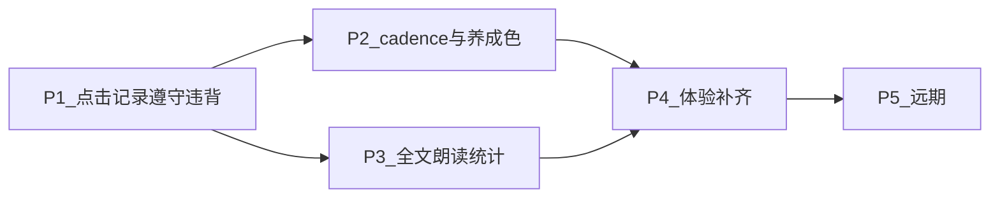

# 行为准则践行 — 讨论结论与分阶段实现

> **讨论阶段：已基本完成。** 以下为冻结决策 + 实现路线图。  
> **P1 已于 2026-06 交付**；详见下方「实现进度」。

---

## 实现进度（截至 2026-06）

### ✅ P1 已完成

| 计划项 | 实现状态 | 代码/文档 |
|--------|----------|-----------|
| 块解析 + 阅读页块列表 | ✅ | `MarkdownBlockParser`、`BlockReaderContent`、`ReaderScreen` |
| Callout 可点践行 | ✅ | 仅 `[!rule]` / `[!habit]`（及任意 `[!xxx]`）`trackable` |
| 侧车存储 | ✅ | `.meta/practice-logs.json`、`.meta/block-registry.json` |
| 今日遵守/违背 + 圆点 | ✅ | 绿/红/灰；取今日最新 **FOLLOWED/VIOLATED** |
| BottomSheet | ✅ | 轻点快记、长按备注、**评论**（`COMMENT`，不影响圆点） |
| 清除今日记录 | ✅ | 展开历史 → 二次确认 → 删今日全部条目 |
| 历史列表 | ✅ | 追加式带时间戳；Sheet 内可展开（非月历） |
| 测试 | ✅ | `PracticeLogStoreTest`、`BlockRegistryTest`、`PracticeSheetTest` 等 |
| 用户文档 | ✅ | `docs/principles-guide.md`、设置内 `PrinciplesGuideContent` |

### P1 相对原计划的差异（有意或演进）

| 原计划 | 实际实现 |
|--------|----------|
| `- [ ]` Todo **也可追踪** | **仅 Callout 可追踪**；Todo 只展示，不弹践行窗（见用户文档） |
| 日志 `{ "2026-06-20": { event, note } }` 按日 map | **追加式数组** + `recordedAt` ISO 时间；兼容旧 map 自动迁移 |
| 事件仅 FOLLOWED / VIOLATED | 增加 **COMMENT**；尚无 PARTIAL / NOT_ENCOUNTERED |
| P1 块 ID：`fileName#line#指纹` | **隐式 UUID**（`block-registry.json`）+ 文本匹配改文保 ID；**P4 提前完成** |
| P1 不做历史 | 已做 **可折叠历史列表**（月历仍属 P2） |
| BlockRegistry 存 cadence 默认 | 仅存 `variant` + `textHint`；cadence 分流留 **P2** |
| `^block-id` 正文锚点 | 解析时识别并迁移；**保存时 strip**（`MarkdownCalloutCleaner`），正文不出现 ID |

### ⏳ P4 部分提前

- ✅ **稳定块 ID**：`BlockRegistry` 隐式 ID、改文 textHint 匹配、legacy ID 迁移（`PracticeLogStore.migrateBlockId`）
- ✅ Callout 卡片背景（轻量，非完整 Notion 色框）
- ❌ 阅读器 Todo `- [ ]` ↔ `- [x]` 切换
- ❌ 今日 daily 待复盘小入口
- ❌ 笔记 rename/trash 时迁移 `.meta` key

### ❌ P2 / P3 / P5 未开始

- cadence 分流（when「遇到了吗」、dailyKind positive/abstention）
- 养成色条、Sheet 月历
- 全文朗读 session 统计（`readLog` / `readStreak`）
- Weekly Review、导出、提醒、meta 同步

---

## 本 App 的定位（讨论起点）

现有优势：
- **Obsidian 同款底层**：`.md` 纯文本、YAML front matter、本地文件夹、可选远程同步（你们是 GitHub）
- **独特能力**：TTS 朗读 — 很适合「晨读准则 / 睡前复盘」场景
- **缺口**：阅读器是一整块 `Text`，无块级交互；无「某天是否践行」的结构化记录

目标延伸：**个人发展 / 行为准则** — 笔记里写原则，阅读时可点、可记、可回顾，而不是只做 passive 朗读。

---

## Notion vs Obsidian：该向谁学？

两者解决同一问题的方式不同，本 App 更适合 **「Obsidian 的数据 + Notion 的交互」** 混合。

| 维度 | Notion | Obsidian | 对本 App 的启示 |
|------|--------|----------|----------------|
| **数据真相** | 云端块数据库 | 本地 Markdown 文件 | 正文继续以 `.md` 为准（已是 Obsidian 路线） |
| **块的感觉** | 每行是块，点击出属性面板 | 编辑模式 vs **阅读模式**；块引用 `^id` | 阅读页做成 Notion 式块列表；编辑可暂保留纯文本 |
| **任务/准则** | Todo 块 + 数据库字段（日期、状态） | `- [ ]` checkbox + **Tasks 插件**（截止日期、完成日） | 已有 `- [ ]` 语法；缺的是「按日践行」层 |
| **强调块** | Callout 块（彩色图标框） | `> [!note]` Callout（与 GitHub/Obsidian 通用） | 直接采用 Obsidian Callout 语法，Notion 风格渲染 |
| **元数据** | 页面 Properties | YAML front matter + `#标签` | front matter 标记笔记类型；标签可后续支持 |
| **日记/回顾** | Linked Database 汇总 | **Daily Note** + Dataview 查询 | 「今日准则」= 跨笔记汇总视图（P2） |
| **习惯追踪** | 需自建 Database | 社区插件（Habit、Tracker）多用 **侧车数据或日记** | 践行日志放 `.meta/` 或日记笔记，不污染正文 |
| **同步** | 官方云 | 文件同步（iCloud/Git） | 你们已用 GitHub；践行 meta 是否同步需单独决策 |



---

## 从两款软件提炼的「准则践行」模式

### 模式 A — Obsidian Tasks 式（正文内嵌）

在 Markdown 里写任务，插件解析元数据：

```markdown
- [ ] 每天运动 30 分钟 ⏫ 🔁 every day
- [x] 冥想 10 分钟 ✅ 2026-06-19
```

- **优点**：全在正文，Git 同步即带走；Obsidian 用户零学习成本
- **缺点**：行会变长；改字可能破坏解析；不适合「三态 + 长备注」高频写入

### 模式 B — Obsidian 日记式（按天记录）

准则留在原则笔记里；**每天一篇 Daily Note** 里打勾：

```markdown
## 2026-06-20 践行
- [x] [[我的准则#^move30]] 运动 30 分钟
- [ ] [[我的准则#^meditate]] 冥想
```

- **优点**：天然按日组织；回顾像写日记；块引用 `^block-id` 稳定
- **缺点**：要维护 Daily Note 结构；跨笔记汇总需 Dataview 级能力（P2/P3）

### 模式 C — Notion 属性式（块 + 结构化字段）

准则块本身不变；**践行状态存在块属性里**（本 App 用 `.meta/` 模拟 Notion DB 字段）：

- 块 ID → `{ "2026-06-20": "DONE", "note": "加班只做了 15 分钟" }`
- **优点**：正文干净；适合三态、 streak、日历；阅读体验像 Notion
- **缺点**：meta 默认不同步；换机丢失（除非后续同步 `.meta`）

### 模式 D — 混合（推荐作为讨论默认）

| 内容 | 存哪里 | 借鉴 |
|------|--------|------|
| 准则原文 | `.md` 正文 | Obsidian |
| 块类型 | `- [ ]` / `> [!rule]` | 两者通用语法 |
| 块稳定 ID | `^abc123` 或行尾 `<!-- bid -->` | Obsidian block ref |
| 每日践行 | `.meta/practice-logs.json` | Notion 属性 + Obsidian 插件侧车 |
| 长期「已完成」 | `- [x]` 写回正文 | Obsidian checkbox |
| 阅读交互 | 块列表 + BottomSheet | Notion |

**语义区分（建议写进产品说明）：**
- `- [x]`：**这条准则我已内化为习惯 / 阶段性完成**（低频，会同步）
- 日历践行：**在某天有没有做到 / 有没有遇到机会**（高频，走 meta；**含义因准则频率而异**，见下节）

---

## 「今日状态点」设计 — 并非所有准则都有「今天」

### 问题

若所有块右侧都显示「今日绿/黄/灰点」，会把 **情境型准则**（如「冲突时先暂停再回应」「被批评时不立刻辩解」）误判为 **每天未完成** — 实际上很多天 **根本用不到这条规则**，灰色 ≠ 失败。

习惯类 App 的 streak 逻辑只适用于 **每日习惯**；行为准则里大量是 **机会型 / 原则型**，需要另一套状态语义。

### 准则频率分层（建议在块 meta 或 Callout 类型里声明）

| 类型 | 示例 | 期望追踪 | 今日状态点 |
|------|------|----------|------------|
| **daily 习惯** | 23:00 前睡觉、日走 8000 步 | 今天做没做 | 绿 / 黄 / 灰(未记) / 红(明确未做) |
| **weekly 周期** | 每周复盘、每周联系一位朋友 | 本周有没有做 | 不显示「今日点」；显示 **本周** 状态或「距上次 N 天」 |
| **when 情境** | 生气时先停 6 秒；开会前写 agenda | 遇到时有没有做到 | **默认无点或中性点**；只有「今天遇到了」才进入践行评价 |
| **always 原则** | 诚实守信 | 长期内化，非日检 | 不显示今日点；仅 **最近践行实例** 或 Sheet 内历史 |

Markdown 写法讨论（可选，P1 也可用侧车 registry 配置）：

```markdown
> [!habit] 每天冥想 10 分钟          <!-- cadence: daily -->
> [!rule] 冲突时先暂停再回应         <!-- cadence: when -->
> [!rule|weekly] 周日做本周复盘       <!-- cadence: weekly -->
```

> **命名说明**：下文 **when** = 情境/opportunity 型（遇到场景才适用），不是「option」；与 **daily / weekly / always** 并列。

---

### 按 cadence 的状态流转（恢复 · 与颜色模型正交）

**两层设计（不互相替代）：**
- **cadence 层**：决定「今天要不要记、怎么问、日历长什么样」（流程）
- **颜色层**：块旁 **养成色**（红←黄→绿）由 **遵守 / 违背 / 未遇到** 滚动累计（结果）

#### when 型（情境 / opportunity）

多数日子处于 **Idle（未遇到）**，这是正常终态，不是失败。



- **未遇到** → 不进入 Opportunity，**不判违背**
- 只有进入 Opportunity 后，才选遵守 / 违背 / 部分

#### daily 型（每日习惯）

每天都有 **DailyOpen**，但未记录 ≠ 自动违背。



- **Unlogged**：可晚间复盘提醒，**不建议自动变红**
- **Violated**：必须用户主动选「今天明确没做到」

#### weekly 型



块旁用 **「本周 ✓ / 未」** 或距上次 N 天，不用「今日点」。

#### always 型

无日更状态机；仅阅读 + Sheet 内可选 **实例** 记录，块旁固定弱色或不追踪。

---

### 按 cadence 的块旁指示（恢复 · 与养成色叠加）

块旁 = **养成色条（长期）** + **cadence 专属辅指示（短期）**。

| cadence | 养成色条 | 辅指示（短期） |
|---------|----------|----------------|
| **daily** | 红←黄→绿，按天滚动计分 | **今日点/环**：绿=已记遵守，黄=部分，灰=未记，红=明确未做 |
| **when** | 只按「遇到」事件计分；未遇到不动色 | **默认无今日点**；`上次 6/15` 或 `本月 2 次`；可选「今天遇到了」后才亮今日标记 |
| **weekly** | 按周计分 | **本周状态** strip 或「距上次 N 天」 |
| **always** | 固定中性或弱追踪 | 无强制指示 |

**A. daily — 今日点（习惯追踪）**

- **灰**：今天还没记（≠ 失败）
- **绿 / 黄 / 红**：今日记录结果
- 旁边 **竖条颜色** = 近 14～30 天养成程度

**B. when — 实例指示（替代「每日未完成灰点」）**

- **Idle 日**：养成色条保持中性；**不要**挂「未完成灰点」
- 用户 **「今天遇到了」** → 进入 Opportunity → 选遵守/违背/部分 → 更新养成色 + 可选闪一下「今日已更新」
- **长按快捷**：「刚刚用到了 ✅」直接记实例 + 备注

**C. weekly — 周期条**

- 7-day mini strip 或「本周 ✓」
- Sheet 按 **周** 汇总

**关键：explicit `N/A` / 未遇到** 与 **遇到了但违背** 必须视觉分离（when 核心）。

---

### Sheet 内按 cadence 分流（恢复）

同一 BottomSheet 外壳，**顶部显示 cadence + 当前养成色**：

| cadence | Sheet 第一步 | 主按钮 | 日历 |
|---------|-------------|--------|------|
| daily | 直接记今天 | 遵守 / 部分 / 违背 | 每天一格 |
| when | **「今天遇到了吗？」** | 否→关闭；是→遵守/部分/违背 | **仅有实例的日期** |
| weekly | 「本周践行了吗？」 | 已践行 / 未 / 违背 | 按周视图 |
| always | 可选记实例 | 遵守 / 违背 + 备注 | 稀疏时间线 |

Sheet 内 **三个（或四个）主事件** 与颜色联动：**遵守 / 违背 / 未遇到**（+ 可选 **部分**）。

---

### 「今日准则」汇总（P2）按 cadence 过滤（恢复）

- **daily**：今日尚未记录的 daily 块
- **when**：**不**列成「待完成」；只列「近期变红需关注」或用户钉选的检视项
- **weekly**：仅在周期截止前（如周日）出现
- **always**：默认不出现

---

### TTS 与 cadence（读 vs 记）

**通读（主动 · 可多次 · 全文）：** 见「全文朗读」— 通勤/休息随时听；统计 **今日是否读过 + 次数**。

**单条读完后的践行提示（仅「记」）：**

| cadence | 通读中 | 单条点读/遇到场景后 |
|---------|--------|---------------------|
| daily | 不逐条弹窗；通读结束后统一提示复盘 | Sheet 用 positive / abstention 文案 |
| when | 只朗读，**不**问今日践行 | Sheet：先问「遇到了吗？」 |
| weekly | 通读包含；践行按周 | 按周 Sheet |
| always | 通读包含；不强制记 | 看无用资讯等可 **可选记实例** |

---

### 颜色养成模型（讨论共识 · 叠加在 cadence 之上）

用户反馈：**用颜色区分「养成程度」**；每日 **遵守 / 违背 / 未遇到** 推动色条变化；长期趋于 **绿（已养成）** 或 **红（尚未养成）**。



#### 三种事件对颜色的影响

| 事件 | 含义 | 颜色 |
|------|------|------|
| **遵守** | 遇到场景且做到 | 向绿移动 |
| **违背** | 遇到场景但没做到 | 向红移动 |
| **未遇到** | 无适用场景 | **不惩罚**（when 默认态） |

**计分差异（与 cadence 绑定）：**
- **daily**：分母=天；未记录 ≠ 违背
- **when**：分母=**遇到次数**；28 天未遇到 → 保持中性色
- **weekly**：分母=周

#### 块旁 UI（合并）

- **主**：养成色竖条 / tint（所有 cadence）
- **辅**：daily=今日点，when=上次日期/次数，weekly=本周 strip
- **动效**：当天刚记录 → 细边框闪一下（与长期色条并存）

#### 手动校准

- 「我认为已养成」→ 固定绿（可同步 `- [x]`）
- 「重新开始练」→ 回初始色

---

### 数据模型（cadence + 颜色 · 合并）

```json
{
  "note.md": {
    "bid-daily-1": {
      "cadence": "daily",
      "dailyKind": "POSITIVE",
      "days": {
        "2026-06-20": { "event": "PARTIAL", "note": "只走了 5000 步" }
      },
      "colorTier": "AMBER",
      "maturityScore": 2
    },
    "bid-when-1": {
      "cadence": "when",
      "instances": [
        { "date": "2026-06-20", "event": "FOLLOWED", "note": "开会前写了 agenda" },
        { "date": "2026-06-18", "event": "VIOLATED", "note": "争论时插话了" }
      ],
      "colorTier": "AMBER"
    },
    "bid-weekly-1": {
      "cadence": "weekly",
      "weeks": { "2026-W25": { "event": "FOLLOWED" } },
      "colorTier": "GREEN"
    }
  },
  "_noteMeta": {
    "principles.md": {
      "readLog": {
        "2026-06-20": { "sessionCount": 3, "lastSessionAt": "2026-06-20T18:30:00Z" },
        "2026-06-19": { "sessionCount": 1, "lastSessionAt": "2026-06-19T08:15:00Z" }
      },
      "readStreak": 5
    }
  }
}
```

- `days` / `instances` / `weeks`：**cadence 决定结构**
- `colorTier` / `maturityScore`：由事件滚动计算，可缓存
- `dailyKind`：`POSITIVE` | `ABSTENTION`（仅 daily，决定 Sheet 文案）
- `_noteMeta.readLog[date].sessionCount`：某日 **全文朗读次数**（可 >1）
- `_noteMeta.readStreak`：连续「当日至少读过 1 次」的天数（非「只能读一次」）
- `event` 枚举：`FOLLOWED` | `PARTIAL` | `VIOLATED` | `NOT_ENCOUNTERED`（when 的 Idle）

---

## 样例：你的准则清单（讨论基准）

以下按你提供的原文整理，并标注建议 **cadence**、**分组** 与 **Sheet 怎么问**。便于对照双层设计（cadence 流程 + 养成色）逐项讨论。

### 建议笔记结构（Markdown 草稿）

```markdown
---
title: 我的行为准则
type: principles
---

# 健康作息

> [!habit|daily] 11 点睡觉，你没有晚睡的资本 ^sleep11

> [!habit|daily] 睡前听听书，别刷手机 ^bedtime-no-phone

# 情绪与行动

> [!rule|when] 行动才是解决焦虑的方法 ^act-not-worry

> [!rule|when] 不应是夸奖型，应该内在目标驱动型 ^intrinsic-not-praise

# 沟通与人际

> [!rule|when] 对于一般的质疑、反驳，不自我解释，面对质疑给别人戴高帽就行；如果必须反驳，要反驳不如提问式，确认式，引导别人了解当初的场景 ^handle-doubt

> [!rule|when] 别轻易跟旁边人诉苦，未必被理解，还可能引发矛盾 ^no-complain

> [!rule|when] 不清楚的不说，有更清楚的让更清楚的说 ^let-clearer-speak

> [!rule|when] 了解一个人比较难：话慢慢说，边看反应；事一件件做，边看反应 ^know-person-slow

> [!rule|when] 看破不说破，说破会惹祸 ^see-not-speak

# 做事方法

> [!rule|when] 魔鬼在细节；别尝试改变其他人；做有价值的事；重事实 ^detail-facts

# 不做清单（每日戒断）

> [!habit|daily] 不看联合早报、社会评论——没提升认知，也没实际用处 ^no-news-scroll

> [!rule|always] 只处理关注圈、能力圈内的事（含：不消费无用信息） ^circle-control

# 认知与学习

> [!rule|when] 用概率打败不确定性，警惕无意义的学习 ^probability-learning
```

> `^id` 为 Obsidian 式块锚（可选）；cadence 也可写在侧车 registry，不必进正文。

---

### 逐条分类与交互说明

| # | 准则（摘要） | cadence | 何时记 / Sheet 怎么问 | 块旁辅指示 |
|---|-------------|---------|----------------------|-----------|
| 1 | 11 点睡觉 | **daily** | 每晚：遵守 / 部分(迟但≤30min) / 违背 / 未记 | 今日点 + 色条 |
| 2 | 睡前听书别刷手机 | **daily** | 睡前复盘；「部分」= 听了但还刷了会儿 | 同上 |
| 3 | 内在驱动非夸奖型 | **when** | 仅在「做目标/激励相关决定」时问遇到了吗 | 色条 + 上次日期 |
| 4 | 行动解焦虑 | **when** | 焦虑出现时：遇到了 → 是否用行动应对 | 同上 |
| 5 | 面对质疑的沟通法（**整块一条**） | **when** | 被质疑/反驳时记；Sheet 先问「遇到了吗？」 | 色条 + 上次日期 |
| 6 | 别轻易诉苦 | **when** | 想诉苦时：遇到了 → 是否忍住 / 换方式 | 同上 |
| 7 | 不清楚的不说 | **when** | 讨论中不确定时 | 同上 |
| 8 | 细节/不改变他人/重事实 | **when** | 想改别人或争论细节时 | 同上 |
| 9 | 不看早报社会评论 | **daily**（**戒断**） | Sheet 文案：**没做坏事** — 遵守=没看，违背=看了 | 今日点 + 色条 |
| 10 | 能力圈/关注圈 | **always** | 弱追踪；**看无用资讯也算违背此条**（与 #9 重叠，见下） | 中性色 + 可读 |
| 11 | 了解人要慢 | **when** | 与新熟人深聊/合作时 | 上次日期 |
| 12 | 看破不说破 | **when** | 想说破时 | 同上 |
| 13 | 概率思维/警惕无效学习 | **when** | 打算开新课、囤资料、刷「学习」时 | 同上 |

**第 5 条：已确认保持一整块**，不拆分；长文靠 Callout 排版 + TTS 通读即可。

**daily 两类 UI 文案（已确认区分）：**

| 类型 | 适用 | Sheet 主文案 | 遵守 | 违背 |
|------|------|-------------|------|------|
| **positive** 养成 | 11 点睡、睡前听书 | 「今天做到了吗？」 | 做到了 | 没做到 |
| **abstention** 戒断 | 不看早报/社会评论 | 「今天有没有做这件事？」 | **没做坏事** | 做了（看了/刷了） |

三条 daily **各自独立 Sheet**，不合并晚间复盘（已确认）。

**#9 与 #10 的关系（已确认）：**

- **#9 daily 戒断**：具体追踪「今天有没有看联合早报/社会评论」
- **#10 always 原则**：更广 — 「能力圈/关注圈」；**看无用东西也属违背此原则**
- 用户看了无用资讯时：可在 #9 记 **违背**；也可（可选）在 #10 记一条 **always 实例** — 两条互补，不合并成一条

---

### 三条代表准则：走一遍状态 + 颜色

#### ① daily —「11 点睡觉」

| 日子 | 用户操作 | cadence 状态 | 颜色 |
|------|----------|--------------|------|
| 周一 23:30 睡 | 记 **部分** | DailyOpen → Partial | 黄偏绿 |
| 周二 00:30 睡 | 记 **违背** | → Violated | 向红移动 |
| 周三 22:50 睡 | 记 **遵守** | → Followed | 向绿移动 |
| 周四 忘了记 | **未记** | Unlogged | **不自动变红** |

Sheet：直接三按钮 + 备注；月历每天一格。

#### ② when —「别轻易跟旁边人诉苦」

| 日子 | 场景 | 用户操作 | cadence 状态 | 颜色 |
|------|------|----------|--------------|------|
| 周一 | 无冲动 | 不打开 Sheet | **Idle** | 中性，不惩罚 |
| 周三 | 想跟同事诉苦 | 遇到了 → **遵守**(忍住) | Opportunity → Followed | 向绿 |
| 周五 | 还是诉苦了 | 遇到了 → **违背** | → Violated | 向红 |
| 两周其他天 | 无场景 | — | Idle | 色条不变 |

Sheet：**先问「今天遇到了吗？」** → 否则关闭；是再选遵守/违背/部分。

#### ③ when —「面对质疑…」（整块，沟通场景）

- 典型 **低频率、高价值** when 型：可能 **两周才遇到一次**
- 块旁长期显示 **「上次 6/8」** 比「今日灰点」更有意义
- 记 **部分**：例如「戴了高帽但没忍住解释了两句」→ 颜色半步向黄
- **通读时**随全文朗读；**不**在每条 when 后弹「今天践行了吗」（见「全文朗读」）

#### ④ daily 戒断 —「不看联合早报、社会评论」

- **abstention** 文案：**遵守 = 没做坏事**，**违背 = 看了**
- 适合睡前单独复盘（与 #1 #2 分开三条 Sheet，不合并）
- 若违背，同时触及 **#10 能力圈** 原则（可选记 always 实例）

---

### 全文朗读（已确认 · 主动、可多次 · 与践行分离）

**产品决策：准则要经常读**（通勤开车、偶尔休息），因为不知道哪天会命中哪条 when 规则 — 多读 = 提醒留在意识里。

**这是用户主动行为，不是「每天只能读一次」：**

| 场景 | 行为 |
|------|------|
| 开车上下班 | TTS 全文朗读（可暂停/续播） |
| 工作间隙 | 再听一遍或接着听 |
| 睡前 | 可再听一遍，与 daily 践行 Sheet 分开 |

**读 ≠ 记**（不变）：朗读次数再多，when 型仍 **Idle 直到遇到**；daily 践行仍各自独立 Sheet。

**统计（已确认）：标记每天是否读过、读了几次**

| 指标 | 含义 | UI 示例 |
|------|------|---------|
| **今日是否读过** | 当日 `sessionCount ≥ 1` | 笔记顶栏「今日已读 ✓」或灰态「今日尚未读」 |
| **今日读了几次** | 当日完整通读次数 +1 | 「今日 2 次」 |
| **连续有天读过** | `readStreak` | 「已连续 5 天有朗读」 |

**何谓一次「session」（讨论默认）：**

- 用户点 **「朗读全部准则」** 并开始播放 → 算 1 session（开始即计，适合通勤半路也算「今天读过」）
- 或：**播完整篇** 才算 1 session（更严格）— 实现前可二选一，默认 **开始即计** 更贴合「开车听了一半也有用」

**UI 草案：**

- 准则笔记顶栏：**「朗读全部准则」**（主按钮，随时可点，不限次数）
- 顶栏辅信息：**今日已读 2 次** · 连续 5 天
- 通读 **结束**（若播完）：轻提示「今日第 2 次通读完成」— **不**对 when 逐条弹践行；可选弱提示「3 条 daily 尚未复盘」
- **不设**「今日已通读就锁定」— 同一日可反复听
- 设置项（P2，可选）：提醒「今天还没读过准则」，**不**限制只能读一次



**与分组重听：** 只读某一节（如「沟通与人际」）可 **不计入** 全文 session，或单独计 `partialRead` — 默认 **仅「朗读全部」计入次数**，避免刷数。

---

### 分组（重听某节时参考）

| 分组 | 块数 | cadence |
|------|------|---------|
| 健康作息 | 2 | daily |
| 情绪与行动 | 2 | when |
| 沟通与人际 | 5 | when |
| 做事方法 | 1 | when |
| 不做清单 | 2 | daily + always |
| 认知与学习 | 1 | when |

「今日待 **检**」（践行）≈ 3 条 daily；「今日 **读**」= 是否读过 + **读了几次**（全文 session，可 >1）。

---

## 内容怎么写：三种「准则笔记」模板（讨论用）

**模板 1 — 清单型**（最简单，现有语法即可）

```markdown
---
title: 我的行为准则
type: principles
---

# 健康
- [ ] 23:00 前睡觉
- [ ] 每天走路 8000 步

# 工作
> [!rule] 开会前先写三条 agenda
```

**模板 2 — Callout 强调型**（Notion/Obsidian 视觉重点）

```markdown
> [!rule] 原则：先回应情绪，再回应事情
> [!habit] 习惯：起床后不看手机直到早餐结束
```

**模板 3 — 段落 + 手动追踪**（普通文字也能变准则）

普通段落默认不追踪；阅读时长按 →「设为准则」→ 写入 block registry（Notion「Turn into」思路，Obsidian 无直接等价）。

---

## 核心交互（讨论稿）

### 阅读页 — 偏 Notion

- 块与块有间距，每块可点
- 块旁 **双层指示**：**养成色条**（长期）+ **cadence 辅指示**（daily 今日点 / when 上次日期 / weekly 本周）
- 点块 → BottomSheet（cadence 分流 + 颜色解释）
- TTS 朗读时当前块轻高亮

### 践行 Sheet

- 见上文 **「Sheet 内按 cadence 分流」** + **颜色养成模型**
- when 必先问「今天遇到了吗？」；daily 直接记今天；统计口径因 cadence 而异

### 编辑页 — 短期偏 Obsidian，长期偏 Notion

- **短期**：仍用现有整篇编辑器 + 工具栏插入 `- [ ]`、`> [!rule]`
- **长期（P2+）**：`/` 命令、块级焦点（Notion 编辑器，工程量大）

---

## 讨论结论（已冻结）

| 议题 | 结论 |
|------|------|
| 数据存放 | `.meta/` 侧车 JSON，正文 `.md` 继续 GitHub 同步 |
| 块 ID | ✅ 隐式 UUID（`block-registry.json`）+ 改文 textHint 匹配；`^id` 解析后保存 strip |
| 准则识别 | Callout `[!xxx]` 可点；`- [ ]` **仅展示**（不追踪） |
| meta 同步 | v1 本地 only |
| 样例笔记 | 13 条准则清单已定（见下） |
| 第 5 条 | 整块一条 |
| daily 文案 | **positive**（做到了）vs **abstention**（没做坏事）— P2 细化 |
| #10 always | 保留；看无用资讯也属能力圈 |
| 晚间复盘 | 三条 daily 各自 Sheet，不合并 |
| 全文朗读 | 主动、可多次；统计今日是否读过 + 次数 — **P3** |
| 双层设计 | cadence 管流程；颜色管养成 — 颜色 **P2** |

---

## 分阶段实现路线图

### P1 — 准则可点 + 今日遵守/违背（**✅ 已完成 · 2026-06**）

**目标：** 阅读准则笔记时，**点击某条准则 → 记录今天是否遵守或违背**。

**范围：**

1. **块解析** [`MarkdownBlockParser`](app/src/main/java/com/andriod/reader/data/local/MarkdownBlockParser.kt)  
   - ✅ 解析 Callout `> [!habit]` / `> [!rule]`（及任意 `[!xxx]`）；Todo/标题/段落只读  
   - ⚠️ **与讨论稿差异**：`- [ ]` 仅展示，**不可追踪**（产品文档已明确）  

2. **侧车存储**  
   - ✅ [`PracticeLogStore`](app/src/main/java/com/andriod/reader/data/local/PracticeLogStore.kt) → 追加式 `.meta/practice-logs.json`（含 legacy 按日 map 迁移）  
   - ✅ [`BlockRegistry`](app/src/main/java/com/andriod/reader/data/local/BlockRegistry.kt) + `block-registry.json` → **隐式 UUID**（非 P1 原计划的行指纹）  
   - ⚠️ cadence 默认（habit→daily、rule→when）**尚未写入 registry**，留 P2  

3. **阅读 UI**  
   - ✅ [`BlockReaderContent`](app/src/main/java/com/andriod/reader/ui/reader/BlockReaderContent.kt)：`LazyColumn`、Callout 卡片、可点  
   - ✅ 块旁圆点：绿/红/灰（COMMENT 不影响圆点）  

4. **践行 Sheet**  
   - ✅ 遵守 / 违背；轻点快记、长按备注；**评论**事件  
   - ✅ 可折叠 **历史**（带时间）；**清除今日**（二次确认）  
   - ✅ 同日可多条追加；圆点取今日最新 FOLLOWED/VIOLATED  
   - ❌ when 门禁、月历、养成色条（仍属 P2）  

5. **测试**  
   - ✅ Parser / Store / Registry / Sheet 测试；`.\runAndroidTest.ps1` 全绿  

**P1 交付时额外完成（原属 P4）：** 隐式块 ID、改文保践行、^锚点 strip。  

**仍留后阶段：** 全文朗读次数、cadence/颜色、今日 daily 汇总、块编辑器 `/` 菜单。

---

### P2 — cadence 分流 + 养成色 + 历史

1. **when 型**：Sheet 先问「今天遇到了吗？」→ 否关闭；是 → 遵守/违背/部分  
2. **未遇到** 显式按钮（when Idle，不惩罚）  
3. **dailyKind**：positive / abstention 两套文案  
4. **块旁养成色条**（红←黄→绿，滚动 14～30 天计分；when 只计「遇到」样本）  
5. Sheet 内 **月历 / 时间线** 历史  
6. **always** 弱追踪：可选记实例（如看无用资讯）  

---

### P3 — 全文朗读统计

1. 顶栏 **「朗读全部准则」**（不限次数）  
2. TTS 按块顺序读整篇 + 块高亮  
3. `.meta` 记录 `readLog[date].sessionCount`、连续「当日至少 1 次」天数  
4. session 计数默认：**开始播放即 +1**（通勤听一半也算）  
5. 播完可选弱提示「3 条 daily 尚未复盘」  

---

### P4 — 体验补齐

1. 阅读器 **Todo 就地 `- [ ]` ↔ `- [x]`** 切换（写回 `.md`）  
2. Callout 视觉（Notion 风格色框）— *已有轻量卡片背景，完整色框待做*  
3. ~~稳定块 ID~~ → **✅ 已提前完成**（隐式 UUID + textHint 匹配 + legacy 迁移；保存 strip `^id`）  
4. **今日 daily 践行** 小入口（3 条待复盘，非合并 Sheet）  
5. 笔记 rename/trash 时迁移 `.meta` key  

---

### P5 — 远期

- Weekly Review、导出 CSV/Markdown  
- 设置提醒（今日尚未朗读准则）  
- GitHub 同步 `.meta/`（可选）  
- Widget、slash 插入 Callout  

---

### 阶段依赖关系



---

## 与现有代码的关系（实现参考）

当前阅读器 [`MarkdownDisplay.kt`](app/src/main/java/com/andriod/reader/ui/reader/MarkdownDisplay.kt) 是单行 `Text`；P1 需改为块列表。存储沿用 [`.meta/` 侧车](app/src/main/java/com/andriod/reader/data/local/SyncStateStore.kt)。

**测试要求（每阶段）：** 补充单元/UI 测试并跑 `.\runAndroidTest.ps1`。

---

## 待讨论的关键问题（已归档 · 见「讨论结论」）

<details>
<summary>原讨论清单（已通过）</summary>

1. 践行数据 → `.meta/`  
2. 块 ID → 指纹，后补 `^id`  
3. 准则笔记 → `type: principles` + Callout/Todo  
4. meta 同步 → v1 本地  
5. P1 → 点击 + 遵守/违背  
6. cadence 默认 → habit=daily, rule=when  

</details>

---

## 原开发分期表（已被上表取代）

~~P1 含全文朗读~~ → 朗读移至 **P3**；P1 仅 **点击 + 记录**。

---

## 开放想法（头脑风暴，可继续加）

- **朗读 + 践行闭环**：通读结束后提示 daily 复盘，不对 when 逐条弹窗
- **原则 vs 习惯**：`[!rule]` 看践行率；`[!habit]` 看 streak（失败更「正常」）
- **Weekly Review 页**：Obsidian Dataview 的移动端简化版
- **反向链接**：某准则被哪些 Daily Note 引用（日记模式 B 的自然延伸）
- **准则版本**：改 wording 时保留旧 blockId 的历史践行（个人成长里很重要）
- **只读分享**：导出准则笔记给其他人，践行 meta 不同步（隐私）

---

## 当前共识

- **阶段**：**P1 已交付（2026-06）** → 下一步 **P3 或 P2**（见下）
- **P1 一句话**：Callout 准则可点，记录 **今日遵守 / 违背 / 评论**，历史追加式本地存储
- **与讨论稿主要差异**：仅 Callout 追踪（非 Todo）；日志为时间戳数组（非按日 map）；块 ID 隐式化（P4 项提前）
- **方向**：Obsidian 正文 + Notion 块交互 + `.meta` 践行数据（仍不同步 GitHub）
- **样例笔记**：13 条准则（第 5 条整块；#10 always；daily 三条独立复盘）
- **建议优先级**：**P3 全文朗读统计**（与开车 TTS 核心场景一致）→ **P2 cadence/养成色**（when 型语义）→ P4 体验 → P5 远期
- **TTS**：继续 **Google TTS 神经语音**（已支持本地/在线偏好）；Edge/Piper/Sherpa/云端免费档见 AGENTS 与 `TtsHelper` 诊断，开车离线场景不建议换引擎除非 Google 不可用
