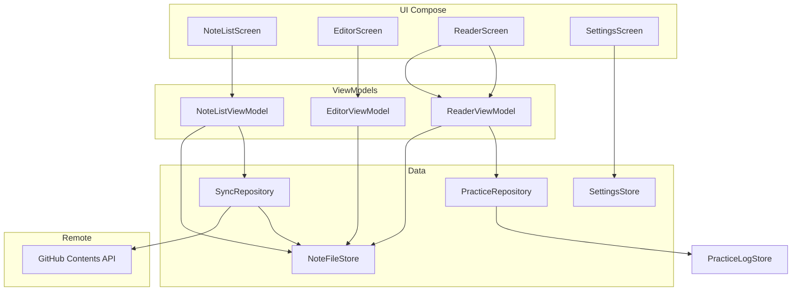

# Agent 上手指南

供 Cursor Agent 与其它自动化助手快速熟悉 **andriod-reader**（Android 笔记朗读 App）。用户向文档见 [README.md](README.md)。

---

## 1. 项目是什么

| 项 | 说明 |
|----|------|
| **用途** | 离线 Markdown 笔记 + 手动 GitHub 同步 + TTS 朗读（开车场景） |
| **本地路径** | `E:\workspace\andriod-reader`（Windows；WSL 为 `/mnt/e/workspace/andriod-reader`） |
| **App 源码仓库** | [dermotv5chat/notes-reader](https://github.com/dermotv5chat/notes-reader) |
| **用户笔记仓库** | [dermotv5chat/notes](https://github.com/dermotv5chat/notes)（与 App 分离；Contents API 同步） |
| **默认分支** | `main` |

**不要混淆两个仓库：** 改 App 代码 push 到 `notes-reader`；用户笔记 `.md` 通过 App 上传到 `notes`。

---

## 2. 技术栈

- **Kotlin** + **Jetpack Compose** + Material 3 + **Hilt**
- **无 Room**：笔记 = 本地 `filesDir/notes/**/*.md`，与 GitHub 结构一致
- **Retrofit** + GitHub Contents API；PAT 存 `EncryptedSharedPreferences`
- **TTS**：`TextToSpeech` + 前台 Service + MediaSession
- **测试**：JVM 单元测试 + Robolectric Compose 测试；入口 `.\runAndroidTest.ps1`
- **minSdk 26**，target 35

---

## 3. 本地存储布局

```
filesDir/
├── notes/                    # 笔记 Markdown（相对路径即 sync 路径，如 content/rules.md）
│   └── **/*.md
├── trash/                    # 删除暂存
└── .meta/
    ├── sync-state.json       # 每文件 githubSha、remotePath、syncStatus、pendingDelete
    ├── practice-logs.json    # 行为准则践行记录（不同步 GitHub）
    ├── block-registry.json # 准则块隐式 ID（不同步 GitHub）
    └── folders.json          # 虚拟文件夹
```

**Front matter**（`MarkdownParser`）：`id`、`title`、`updatedAt`。编辑保存后已同步笔记变为 `PENDING`，但 **保留旧 `githubSha`** 直至上传成功。

**SyncStatus**：`LOCAL_ONLY` | `PENDING` | `SYNCED`

---

## 4. 架构概览



**原则：** UI → ViewModel → Repository → FileStore / API。业务逻辑优先放 repository 或纯函数 policy 对象，便于单测。

---

## 5. 模块地图

| 领域 | 关键文件 |
|------|----------|
| **笔记 CRUD** | `NoteFileStore.kt`, `NoteRepository.kt`, `MarkdownParser.kt` |
| **列表 / 文件夹 / 回收站** | `NoteListScreen.kt`, `NoteListViewModel.kt`, `NoteTreeBrowser.kt`, `TrashStore.kt` |
| **编辑** | `EditorScreen.kt`, `EditorViewModel.kt`, `EditorFormattingToolbar.kt`, `MarkdownEditorActions.kt` |
| **阅读** | `ReaderScreen.kt`, `BlockReaderContent.kt`, `MarkdownDisplay.kt` |
| **行为准则 P1** | `MarkdownBlockParser.kt`, `PracticeLogStore.kt`, `PracticeRepository.kt`, `PracticeSheet.kt` |
| **GitHub 同步** | `SyncRepository.kt`, `SyncUploadPolicy.kt`, `SyncUploadPaths.kt`, `SyncDownloadPolicy.kt`, `GitHubApi.kt` |
| **TTS** | `TtsController.kt`, `TtsPlaybackService.kt`, `TtsHelper.kt`, `TtsMiniPlayerBar.kt` |
| **主题** | `AppThemeMode.kt`, `Theme.kt`, `SettingsStore`（`appThemeMode`） |
| **导航** | `Navigation.kt`, `NavArgs.kt`（子路径笔记用 query + `Uri.encode`） |
| **DI** | `AppModule.kt`, `ReaderApplication.kt` |

---

## 6. 已实现功能（CHANGELOG 之后）

以下在 [CHANGELOG.md](CHANGELOG.md) 1.0.0 之后合入，排期文档可能未更新：

### 6.1 深色模式（`e49ab9b`）

- 设置：浅色 / 深色 / 跟随系统
- `SettingsStore.appThemeMode`、`ReaderTheme`、`AppThemeResolverTest`

### 6.2 行为准则 P1

- **可点击块**：`> [!rule]`、`> [!habit]`（及任意 `[!xxx]` callout）；普通 `- [ ]` 待办不弹践行窗
- 阅读页点击 → 今日 **遵守 / 违背** + 可选备注
- 记录仅本地 `.meta/practice-logs.json`，**不上传 GitHub**
- 编辑器工具栏：**准则** / **习惯** 按钮
- 用户文档：[docs/principles-guide.md](docs/principles-guide.md)；App 内 **设置 → 行为准则使用说明**

### 6.3 阅读页 UI

- `LazyColumn` 顶部 `contentPadding` 12dp
- 空行不在阅读页展示（`shouldDisplayInReader()`）
- 仅 **可践行块** 有圆角卡片背景；标题/段落为纯文本

### 6.4 GitHub 上传冲突修复（`bc147eb` + 文档 `739afad`）

**现象：** 上传报 409 JSON，或误报「无法访问 dermotv5chat/notes」404。

**机制：**

- 409 → 拉远程 SHA，按 `updatedAt` 自动重试或弹冲突对话框（与下载相同三选一）
- 404/422 → 远程文件缺失则无 SHA 重建；路径回退 `SyncUploadPaths`
- 逐文件写入 sync state；删除远程 404 视为已删

**详述：** [docs/github-sync-upload-conflict.md](docs/github-sync-upload-conflict.md)

### 6.5 Git 提交脚本（`25d90e6`）

- `commit.ps1`：**Windows** stage+commit，**`-p` 时 WSL** 仅 push（SSH 在 WSL）
- `commit.sh --push-only`、`-Wsl` 可选全流程 WSL
- 规则：`.cursor/rules/git-via-wsl.mdc`

---

## 7. Agent 必守规则

项目 `.cursor/rules/`（`alwaysApply: true`）：

| 规则 | 要求 |
|------|------|
| **testing-after-changes.mdc** | 功能/修复/重构后补充测试，并跑 `.\runAndroidTest.ps1` 全量通过 |
| **git-via-wsl.mdc** | 提交用 `.\commit.ps1`；禁止 PowerShell 直接 `git push`；用户未要求不 commit |

**代码原则（用户偏好）：** 最小 diff、不过度抽象、匹配现有风格、注释只写非显而易见逻辑。

**禁止提交：** `pat.txt`、`local.properties`、`.env`、`app/build/`、`.gradle/`

---

## 8. 常用命令

```powershell
cd E:\workspace\andriod-reader

# 单元测试（改代码后必跑）
.\runAndroidTest.ps1

# 装到真机
.\install2device.ps1

# 提交（Agent /commit 内部调用）
.\commit.ps1 "fix: message"
.\commit.ps1 -p "fix: message"

# 仅构建 APK
$env:JAVA_HOME = "C:\Program Files\Android\Android Studio\jbr"
$env:GRADLE_USER_HOME = "$env:USERPROFILE\.gradle"
.\gradlew.bat assembleDebug
```

**Cursor 命令：** `/commit`、`/commit -p` → 见 [.cursor/commands/commit.md](.cursor/commands/commit.md)

**`/commit` 默认后台：** 主 Agent 只读 diff 并写 message，再用 **shell subagent（`run_in_background: true`）** 跑 `commit.ps1`，不阻塞讨论其它功能；要同步等结果时用 `/commit -sync -p`。

---

## 9. 测试约定

- 逻辑测试：`app/src/test/java/...`
- Compose UI 测试：Robolectric（如 `ReaderSleepTimerSheetTest`、`PrinciplesGuideScreenTest`）
- 同步策略：`SyncUploadPolicyTest`、`SyncUploadPathsTest`、`SyncDownloadPolicyTest`
- **不要**只跑单个用例收尾；用 `runAndroidTest.ps1` 跑全套

---

## 10. GitHub 同步要点（改 sync 代码前必读）

|  topic | 说明 |
|--------|------|
| API | Contents API PUT/GET/DELETE；不是 git 协议 |
| 默认仓库 | owner `dermotv5chat`，repo `notes`（SettingsStore 可改） |
| 上传筛选 | `PENDING`、`LOCAL_ONLY`、`pendingDelete` |
| 下载 | 递归扫描全仓库 `.md`；冲突时 `NoteListViewModel.awaitConflictResolution` |
| 404 语义 | 无 Token 访问私有库也会 404；与「文件不存在」需在上传逻辑内区分处理 |
| 电脑协作 | 用户可用 SSH `git push` 同一 `notes` 仓库；与手机 PAT 并存 |

---

## 11. 路线图（未实现 / 讨论中）

完整讨论稿与实现进度见 [`.cursor/plans/notion式准则践行_7019e43e.plan.md`](.cursor/plans/notion式准则践行_7019e43e.plan.md)。

| 阶段 | 内容 | 状态 |
|------|------|------|
| **P1** | Callout 可点、今日践行、历史、评论、隐式块 ID | ✅ 已实现 |
| **P2** | 准则频率（daily/when）、色条、日历 | 📋 计划 |
| **P3** | 全文朗读 session 统计 | 📋 计划 |
| **二期** | 块拖拽编辑、富文本、自动同步等 | 📋 [docs/二期功能讨论.md](docs/二期功能讨论.md) |

**P2+ 产品讨论摘要：**

- 块 ID：用户倾向 **按空行分段自动生成**，当前仍是 **按行 parser**（`MarkdownBlockParser`）
- 践行数据保持本地不同步；准则正文在 `.md` 里同步 GitHub

---

## 12. 已知踩坑

| 问题 | 处理 |
|------|------|
| TTS 在 MIUI 初始化失败 | Activity Context、`attemptId` 防竞态 → [docs/tts-engine-init-failure.md](docs/tts-engine-init-failure.md) |
| 车机/蓝牙耳机无法暂停 | AVRCP 媒体键解析 → [docs/tts-bluetooth-media-controls.md](docs/tts-bluetooth-media-controls.md) |
| 子目录笔记导航失败 | 路径用 query 参数 + encode，勿用 path 段 |
| `commit.ps1` WSL 引号 | 已改为 Windows commit + WSL push-only；勿 `wsl bash -lc $unquoted` |
| 编辑页键盘顶内容 | 见 [docs/editor-keyboard-toolbar-layout.md](docs/editor-keyboard-toolbar-layout.md) |
| Gradle 重复下载 | 设 `GRADLE_USER_HOME`；优先 `install2device.ps1` / `runAndroidTest.ps1` |

---

## 13. 文档索引

| 文档 | 用途 |
|------|------|
| [README.md](README.md) | 用户向：构建、安装、首次配置 |
| [CHANGELOG.md](CHANGELOG.md) | 1.0.0 功能清单 |
| [docs/principles-guide.md](docs/principles-guide.md) | 行为准则 Markdown 写法 |
| [.cursor/plans/notion式准则践行_7019e43e.plan.md](.cursor/plans/notion式准则践行_7019e43e.plan.md) | 准则践行 P1–P5 讨论稿与实现进度 |
| [docs/github-sync-upload-conflict.md](docs/github-sync-upload-conflict.md) | 上传 409/404 根因与修复 |
| [docs/二期功能讨论.md](docs/二期功能讨论.md) | 二期成本与方案 |
| [docs/install-to-device.md](docs/install-to-device.md) | 真机安装 |
| [docs/debug-vs-release-builds.md](docs/debug-vs-release-builds.md) | Debug/Release |
| [docs/tts-engine-init-failure.md](docs/tts-engine-init-failure.md) | TTS 排查 |
| [docs/tts-screen-off-playback.md](docs/tts-screen-off-playback.md) | 熄屏播放 |
| [docs/tts-notification-permission.md](docs/tts-notification-permission.md) | 通知权限 |
| [docs/tts-bluetooth-media-controls.md](docs/tts-bluetooth-media-controls.md) | 蓝牙 / 车机播放暂停（AVRCP） |
| [.cursor/commands/commit.md](.cursor/commands/commit.md) | `/commit` 命令 |
| [.cursor/rules/](.cursor/rules/) | Agent 持久规则 |

---

## 14. 改完功能后的检查清单

1. 范围是否最小、是否符合现有命名与分层？
2. 是否新增/更新 `src/test` 对应用例？
3. `.\runAndroidTest.ps1` 是否全绿？
4. 是否需更新 `docs/` 或本文件？
5. 用户是否明确要求 **commit**？若 commit 用 `.\commit.ps1`，push 仅 `-p` 时。

---

*最后更新：2026-06，涵盖深色模式、P1 行为准则、GitHub 上传冲突修复、commit 脚本分工。*
