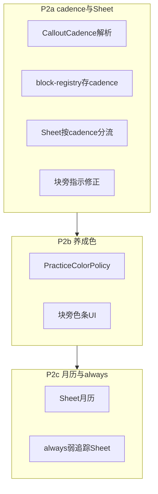

---

name: P2 准则践行

overview: 分 3 次迭代落地 plan 中 P2：先建立 cadence/dailyKind 模型与 Sheet 分流（修正 when 型误判），再叠加养成色条，最后补 Sheet 月历与 always 弱追踪。weekly 暂留枚举占位，不做专用 UI。

todos:

  - id: p2a-model

    content: "P2a: PracticeCadence/DailyKind + PARTIAL/NOT_ENCOUNTERED；CalloutCadenceResolver；扩展 BlockRegistry 与 NoteBlock.Callout"

    status: completed

  - id: p2a-sheet

    content: "P2a: PracticeSheet when 门禁 + dailyKind 文案 + 部分按钮；PracticeBlockIndicator 按 cadence 显示圆点/上次日期"

    status: completed

  - id: p2a-tests-docs

    content: "P2a: resolver/store/sheet 测试；principles-guide 与 plan 进度更新；runAndroidTest.ps1"

    status: completed

  - id: p2b-color

    content: "P2b: PracticeColorPolicy 30 天计分 + 块旁竖条 UI + 单测"

    status: completed

  - id: p2c-calendar

    content: "P2c: PracticeHistoryCalendar 月历 + always 文案完善 + Compose 测试"

    status: completed

isProject: false

---

# P2 准则践行 — 分阶段执行计划

依据 `[.cursor/plans/notion式准则践行_7019e43e.plan.md](.cursor/plans/notion式准则践行_7019e43e.plan.md)` §P2，结合当前实现（P1 已完成：Callout 践行、追加历史、COMMENT、隐式块 ID）。

**当前缺口（P2 要解决的）：**

- 所有 Callout 共用 daily 式 Sheet（「遵守/违背」+ 今日圆点），**when 型**多数日子不应显示灰色「未完成」

- `[CalloutLineParser](app/src/main/java/com/andriod/reader/data/local/CalloutLineParser.kt)` 已能解析 `[!habit|daily]` 的 `**|` 后缀**，但未使用

- `[BlockRegistryEntry](app/src/main/java/com/andriod/reader/data/local/BlockRegistryStore.kt)` 仅存 `variant` + `textHint`，无 cadence

- `[PracticeEvent](app/src/main/java/com/andriod/reader/domain/PracticeModels.kt)` 无 `PARTIAL` / `NOT_ENCOUNTERED`

- 无养成色条、无月历视图

---

## 迭代 P2a — cadence 模型 + Sheet 分流 + 块旁指示（优先）

### 1. 领域模型

新增纯类型（建议 `domain/PracticeCadence.kt`）：

| 类型                | 说明                                         |

| ----------------- | ------------------------------------------ |

| `PracticeCadence` | `DAILY`, `WHEN`, `WEEKLY`(占位), `ALWAYS`    |

| `DailyKind`       | `POSITIVE`（做到了/没做到）, `ABSTENTION`（没做坏事/做了） |

扩展 `[PracticeEvent](app/src/main/java/com/andriod/reader/domain/PracticeModels.kt)`：

- `PARTIAL` — 参与状态圆点（黄色）与色条计分

- `NOT_ENCOUNTERED` — when 可选记录；**不参与**圆点/色条惩罚（plan 共识）

更新 `[PracticeLogStore](app/src/main/java/com/andriod/reader/data/local/PracticeLogStore.kt)` 的 `isStatusEvent()`：包含 `PARTIAL`；排除 `COMMENTNOT_ENCOUNTERED`。

### 2. Cadence 解析与持久化

新增 `CalloutCadenceResolver`（纯函数，易单测）：

- 输入：Callout `variant` + pipe 后缀`[CalloutLineParser](app/src/main/java/com/andriod/reader/data/local/CalloutLineParser.kt)` group2，按 `|` 拆分）

- 默认规则（与 plan 冻结一致）`habit` → `DAILYrule` 及其他 variant → `WHEN`

- 显式后缀`daily` / `when` / `always` / `weeklyabstention` 标记 → `DailyKind.ABSTENTION`

- 示例`> [!habit|daily|abstention] 不看早报…`

扩展 `[CalloutKey](app/src/main/java/com/andriod/reader/data/local/BlockRegistry.kt)` 携带 `modifiers: List<String>[BlockRegistryEntry](app/src/main/java/com/andriod/reader/data/local/BlockRegistryStore.kt)` 增加 `cadencedailyKind`（JSON 兼容：缺字段走默认）。

`[NoteBlock.Callout](app/src/main/java/com/andriod/reader/domain/NoteBlock.kt)` 增加 `cadencedailyKind`，由 `[PracticeRepository.parseBlocks](app/src/main/java/com/andriod/reader/data/repository/PracticeRepository.kt)` 注入。

### 3. Sheet 按 cadence 分流

扩展 `[PracticeSheetState](app/src/main/java/com/andriod/reader/ui/reader/BlockReaderContent.kt)cadencedailyKind`。

`[PracticeSheetContent](app/src/main/java/com/andriod/reader/ui/reader/BlockReaderContent.kt)` 内用 `remember` 状态机：

| cadence    | Sheet 流程                                                        |

| ---------- | --------------------------------------------------------------- |

| **DAILY**  | 直接记录区；文案按 `dailyKind` 切换按钮标签（positive vs abstention）            |

| **WHEN**   | 第一步「今天遇到了吗？」→ **没遇到** 关闭（Idle，不写 log）→ **遇到了** 进入 遵守/部分/违背 + 评论 |

| **ALWAYS** | 弱化标题「可选记录实例」；仅 遵守/违背/部分 + 评论；无今日圆点                              |

| **WEEKLY** | P2a 暂与 WHEN 相同占位，文档标注「后续专用 UI」                                  |

保留 P1 交互：轻点快记、长按备注、评论按钮；**新增「部分」按钮**`PARTIAL`）。

`[PracticeNoteDialog](app/src/main/java/com/andriod/reader/ui/reader/PracticeNoteDialog.kt)` 补充 `PARTIAL` 文案。

`[ReaderViewModel.onTrackableBlockClick](app/src/main/java/com/andriod/reader/ui/reader/ReaderViewModel.kt)` 传入 Callout 的 cadence/dailyKind。

### 4. 块旁指示（辅指示，无色条）

修改 `[PracticeStatusDot](app/src/main/java/com/andriod/reader/ui/reader/BlockReaderContent.kt)` → `PracticeBlockIndicator(cadence, todayEntry, lastStatusDate)`：

- **DAILY**：灰/绿/黄/红 圆点`PARTIAL` → 黄`null` → 灰）

- **WHEN**：**无记录时不显示圆点**；今日有 status 事件时显示圆点；旁侧小字「上次 M/d」（取自 history 最近 status 日期）

- **ALWAYS**：不显示圆点（或极弱 outline，可选）

- **WEEKLY**：P2a 仅显示「上次 M/d」

### 5. P2a 测试与文档

- 单测`CalloutCadenceResolverTestPracticeLogStoreTest`（PARTIAL/NOT_ENCOUNTERED 圆点逻辑）

- Compose`PracticeSheetTest` — when 门禁、dailyKind 文案、部分按钮

- 更新 `[docs/principles-guide.md](docs/principles-guide.md)[PrinciplesGuideContent.kt](app/src/main/java/com/andriod/reader/ui/guide/PrinciplesGuideContent.kt)`（pipe 写法、cadence 说明）

- 更新 plan 文件 P2 todo 进度

- `.\runAndroidTest.ps1` 全绿

---

## 迭代 P2b — 养成色条

### 1. 计分策略（纯函数）

新增 `PracticeColorPolicy.ktsrc/main/java/.../domain/` 或 `data/local/`）：

- 输入：cadence + 近 **30 天** status 事件列表（已有 `getHistoryForBlock`）

- **DAILY**：分母 = 有记录的天数；未记录天不计入

- **WHEN**：分母 = **遇到**次数（FOLLOWED/VIOLATED/PARTIAL）`NOT_ENCOUNTERED` 与无记录不动色

- 权重`FOLLOWED +1PARTIAL +0.5VIOLATED -1` → 映射 `NEUTRAL / RED / AMBER / GREEN`

- **不写入 JSON 缓存**（v1 实时计算，避免迁移复杂度；后续可缓存到 registry）

### 2. UI

`[NoteBlockRow](app/src/main/java/com/andriod/reader/ui/reader/BlockReaderContent.kt)` 左侧加 **4dp 竖条**`PracticeMaturityBar`），颜色来自 policy；与圆点/「上次日期」并存（plan 双层指示）。

`[PracticeRepository](app/src/main/java/com/andriod/reader/data/repository/PracticeRepository.kt)` 暴露 `getMaturityTier(file, blockId, cadence)`。

### 3. P2b 测试

- `PracticeColorPolicyTest` — 覆盖 plan 样例 #1 daily、#2 when Idle 不惩罚、违背向红

- 可选 Compose snapshot：块行含色条

---

## 迭代 P2c — Sheet 月历 + always 弱追踪

### 1. Sheet 月历

在 `[PracticeSheetContent](app/src/main/java/com/andriod/reader/ui/reader/BlockReaderContent.kt)` 历史区上方或替代折叠列表（可 Tab：**列表 | 月历**）：

- 组件 `PracticeHistoryCalendar`：当前月网格，有 status 事件的日期着色（绿/黄/红）

- **WHEN**：仅显示有实例的日期（plan：sparse calendar）

- **DAILY**：每天一格；无记录空格

- 点击某日可展开该日条目（读 history 按日 filter）

数据：复用现有 append-only history，不改编 storage schema。

### 2. always 弱追踪

- Sheet 文案与无圆点已在 P2a 完成；P2c 补：**可选**「记录一次实例」引导文案，与 #9/#10 互补说明写进 principles-guide

- 不强制 daily 汇总入口（留 P4）

### 3. P2c 测试与文档

- `PracticeHistoryCalendarTest`（Robolectric：某月有 3 个着色日）

- principles-guide 补充 always / 月历截图式说明

---

## 刻意不做（仍属 P3/P4/P5）

| 项                          | 阶段                    |

| -------------------------- | --------------------- |

| weekly 专用 Sheet / 本周 strip | P2 占位枚举即可，完整 UI 可跟 P4 |

| 今日 daily 待复盘汇总入口           | P4                    |

| 全文朗读 session 统计            | P3                    |

| meta 同步 GitHub             | P5                    |

| 手动「我认为已养成 → 固定绿」           | P5 或 P4 末             |

---

## 关键文件一览

| 层   | 文件                                                                      |

| --- | ----------------------------------------------------------------------- |

| 解析  | `CalloutLineParser.kt`, 新 `CalloutCadenceResolver.kt`                   |

| 存储  | `BlockRegistryStore.kt`, `BlockRegistry.kt`, `PracticeLogStore.kt`      |

| 领域  | `PracticeModels.kt`, 新 `PracticeCadence.kt`, 新 `PracticeColorPolicy.kt` |

| UI  | `BlockReaderContent.kt`, `PracticeNoteDialog.kt`, `ReaderViewModel.kt`  |

| 测试  | `PracticeSheetTest.kt`, 新 resolver/color 单测                             |

| 文档  | `principles-guide.md`, `PrinciplesGuideContent.kt`, plan 进度             |

---

## 建议执行顺序

1. **P2a**（本次开发重点）— 产品价值最大：修正 when 语义 + abstention 文案

2. **P2b** — 可视化养成进度

3. **P2c** — 回顾体验（月历）

每迭代独立 commit，迭代末跑 `.\runAndroidTest.ps1`。